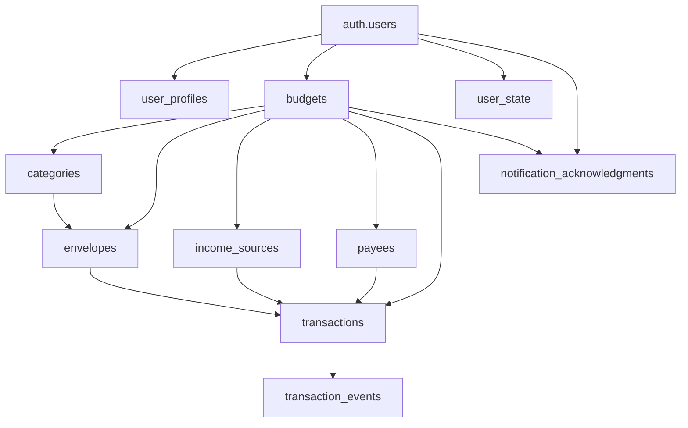

# NVLP Database Data Dictionary

## Overview
This document provides a comprehensive reference for all database tables, columns, constraints, and relationships in the NVLP (No-Vendor Ledger Platform) system.

## Table of Contents
- [Core Tables](#core-tables)
- [Audit Tables](#audit-tables)
- [Enums](#enums)
- [Indexes](#indexes)
- [Constraints](#constraints)
- [Row Level Security (RLS) Policies](#row-level-security-rls-policies)
- [Database Functions](#database-functions)
- [Triggers](#triggers)

---

## Core Tables

### user_profiles
Extends the built-in `auth.users` table with additional profile information.

| Column | Type | Constraints | Description |
|--------|------|-------------|-------------|
| id | UUID | PK, FK → auth.users(id) | User identifier |
| email | TEXT | NOT NULL | User's email address |
| full_name | TEXT | | User's full name |
| avatar_url | TEXT | | URL to user's avatar image |
| timezone | TEXT | DEFAULT 'UTC' | User's timezone preference |
| notification_preferences | JSONB | DEFAULT '{}' | User notification settings |
| is_active | BOOLEAN | DEFAULT true | Whether user account is active |
| created_at | TIMESTAMPTZ | DEFAULT NOW() | Record creation timestamp |
| updated_at | TIMESTAMPTZ | DEFAULT NOW() | Last update timestamp |

**Constraints:**
- `user_profiles_email_valid`: Email format validation
- `user_profiles_timezone_valid`: Timezone validation

---

### budgets
Core budget entities that group all financial data.

| Column | Type | Constraints | Description |
|--------|------|-------------|-------------|
| id | UUID | PK, DEFAULT gen_random_uuid() | Budget identifier |
| user_id | UUID | NOT NULL, FK → auth.users(id) | Budget owner |
| name | TEXT | NOT NULL | Budget name |
| description | TEXT | | Budget description |
| is_default | BOOLEAN | DEFAULT false | Whether this is user's default budget |
| is_active | BOOLEAN | DEFAULT true | Whether budget is active |
| created_at | TIMESTAMPTZ | DEFAULT NOW() | Record creation timestamp |
| updated_at | TIMESTAMPTZ | DEFAULT NOW() | Last update timestamp |

**Constraints:**
- `budgets_name_not_empty`: Name cannot be empty
- `budgets_unique_default_per_user`: Only one default budget per user (partial unique index)

---

### categories
Categories for grouping envelopes (e.g., "Housing", "Food", "Transportation").

| Column | Type | Constraints | Description |
|--------|------|-------------|-------------|
| id | UUID | PK, DEFAULT gen_random_uuid() | Category identifier |
| budget_id | UUID | NOT NULL, FK → budgets(id) | Parent budget |
| name | TEXT | NOT NULL | Category name |
| description | TEXT | | Category description |
| color | TEXT | DEFAULT '#6B7280' | Category color (hex code) |
| icon | TEXT | | Category icon identifier |
| is_active | BOOLEAN | DEFAULT true | Whether category is active |
| sort_order | INTEGER | DEFAULT 1 | Display sort order |
| category_type | category_type_enum | DEFAULT 'expense' | Category type |
| created_at | TIMESTAMPTZ | DEFAULT NOW() | Record creation timestamp |
| updated_at | TIMESTAMPTZ | DEFAULT NOW() | Last update timestamp |

**Constraints:**
- `categories_name_not_empty`: Name cannot be empty
- `categories_color_hex`: Color must be valid hex format
- `categories_sort_order_positive`: Sort order must be positive
- `categories_unique_name_per_budget`: Unique name per budget

---

### envelopes
Envelope budgeting containers for allocating money.

| Column | Type | Constraints | Description |
|--------|------|-------------|-------------|
| id | UUID | PK, DEFAULT gen_random_uuid() | Envelope identifier |
| budget_id | UUID | NOT NULL, FK → budgets(id) | Parent budget |
| category_id | UUID | FK → categories(id) | Parent category |
| name | TEXT | NOT NULL | Envelope name |
| description | TEXT | | Envelope description |
| color | TEXT | DEFAULT '#10B981' | Envelope color (hex code) |
| icon | TEXT | | Envelope icon identifier |
| is_active | BOOLEAN | DEFAULT true | Whether envelope is active |
| sort_order | INTEGER | DEFAULT 1 | Display sort order |
| current_balance | DECIMAL(12,2) | DEFAULT 0 | Current envelope balance |
| target_amount | DECIMAL(12,2) | | Target/goal amount |
| should_notify | BOOLEAN | DEFAULT false | Enable notifications |
| notify_date | DATE | | Date-based notification trigger |
| notify_amount | DECIMAL(12,2) | | Amount-based notification trigger |
| created_at | TIMESTAMPTZ | DEFAULT NOW() | Record creation timestamp |
| updated_at | TIMESTAMPTZ | DEFAULT NOW() | Last update timestamp |

**Constraints:**
- `envelopes_name_not_empty`: Name cannot be empty
- `envelopes_color_hex`: Color must be valid hex format
- `envelopes_sort_order_positive`: Sort order must be positive
- `envelopes_target_amount_positive`: Target amount must be positive
- `envelopes_notify_amount_positive`: Notify amount must be positive
- `envelopes_notification_required`: If notifications enabled, at least one trigger required
- `envelopes_unique_name_per_budget`: Unique name per budget

---

### income_sources
Sources of income for budgeting and tracking.

| Column | Type | Constraints | Description |
|--------|------|-------------|-------------|
| id | UUID | PK, DEFAULT gen_random_uuid() | Income source identifier |
| budget_id | UUID | NOT NULL, FK → budgets(id) | Parent budget |
| name | TEXT | NOT NULL | Income source name |
| description | TEXT | | Income source description |
| expected_monthly_amount | DECIMAL(12,2) | | Expected monthly income |
| is_active | BOOLEAN | DEFAULT true | Whether source is active |
| should_notify | BOOLEAN | DEFAULT false | Enable notifications |
| frequency | income_frequency | DEFAULT 'monthly' | Income frequency |
| custom_day | INTEGER | | Day of month for custom frequency |
| next_expected_date | DATE | | Next expected income date |
| created_at | TIMESTAMPTZ | DEFAULT NOW() | Record creation timestamp |
| updated_at | TIMESTAMPTZ | DEFAULT NOW() | Last update timestamp |

**Constraints:**
- `income_sources_name_not_empty`: Name cannot be empty
- `income_sources_amount_positive`: Expected amount must be positive
- `income_sources_custom_day_valid`: Custom day must be 1-31
- `income_sources_custom_day_required`: Custom day required when frequency is 'custom'
- `income_sources_unique_name_per_budget`: Unique name per budget

---

### payees
Entities that receive payments (businesses, people, services).

| Column | Type | Constraints | Description |
|--------|------|-------------|-------------|
| id | UUID | PK, DEFAULT gen_random_uuid() | Payee identifier |
| budget_id | UUID | NOT NULL, FK → budgets(id) | Parent budget |
| name | TEXT | NOT NULL | Payee name |
| description | TEXT | | Payee description |
| payee_type | payee_type_enum | DEFAULT 'business' | Payee type |
| contact_email | TEXT | | Contact email address |
| contact_phone | TEXT | | Contact phone number |
| contact_address | TEXT | | Contact physical address |
| website_url | TEXT | | Payee website URL |
| notes | TEXT | | Additional notes |
| is_active | BOOLEAN | DEFAULT true | Whether payee is active |
| default_category_id | UUID | FK → categories(id) | Default category for transactions |
| total_paid | DECIMAL(12,2) | DEFAULT 0 | Total amount paid to this payee |
| last_payment_date | DATE | | Date of last payment |
| last_payment_amount | DECIMAL(12,2) | | Amount of last payment |
| created_at | TIMESTAMPTZ | DEFAULT NOW() | Record creation timestamp |
| updated_at | TIMESTAMPTZ | DEFAULT NOW() | Last update timestamp |

**Constraints:**
- `payees_name_not_empty`: Name cannot be empty
- `payees_contact_email_valid`: Email format validation
- `payees_contact_address_length`: Address length limit (500 chars)
- `payees_total_paid_positive`: Total paid must be non-negative
- `payees_last_payment_amount_positive`: Last payment amount must be positive
- `payees_unique_name_per_budget`: Unique name per budget

---

### transactions
Financial transactions for all money movements.

| Column | Type | Constraints | Description |
|--------|------|-------------|-------------|
| id | UUID | PK, DEFAULT gen_random_uuid() | Transaction identifier |
| budget_id | UUID | NOT NULL, FK → budgets(id) | Parent budget |
| transaction_type | transaction_type_enum | NOT NULL | Transaction type |
| amount | DECIMAL(12,2) | NOT NULL | Transaction amount |
| description | TEXT | NOT NULL | Transaction description |
| transaction_date | DATE | NOT NULL | Transaction date |
| from_envelope_id | UUID | FK → envelopes(id) | Source envelope |
| to_envelope_id | UUID | FK → envelopes(id) | Destination envelope |
| payee_id | UUID | FK → payees(id) | Transaction payee |
| income_source_id | UUID | FK → income_sources(id) | Income source |
| category_id | UUID | FK → categories(id) | Transaction category |
| reference_number | TEXT | | External reference number |
| notes | TEXT | | Additional notes |
| is_cleared | BOOLEAN | DEFAULT false | Whether transaction is cleared |
| is_reconciled | BOOLEAN | DEFAULT false | Whether transaction is reconciled |
| created_by | UUID | NOT NULL, FK → auth.users(id) | User who created transaction |
| modified_by | UUID | NOT NULL, FK → auth.users(id) | User who last modified transaction |
| is_deleted | BOOLEAN | DEFAULT false | Soft delete flag |
| deleted_at | TIMESTAMPTZ | | Deletion timestamp |
| deleted_by | UUID | FK → auth.users(id) | User who deleted transaction |
| created_at | TIMESTAMPTZ | DEFAULT NOW() | Record creation timestamp |
| updated_at | TIMESTAMPTZ | DEFAULT NOW() | Last update timestamp |

**Constraints:**
- `transactions_amount_positive`: Amount must be positive
- `transactions_description_not_empty`: Description cannot be empty
- `transactions_income_requirements`: Income transactions require income_source_id
- `transactions_expense_requirements`: Expense transactions require from_envelope_id and payee_id
- `transactions_allocation_requirements`: Allocation transactions require to_envelope_id
- `transactions_transfer_requirements`: Transfer transactions require both envelope IDs
- `transactions_debt_payment_requirements`: Debt payment transactions require from_envelope_id and payee_id
- `transactions_envelope_different`: Transfer source and destination must be different

---

### user_state
Tracks user's financial state and available money.

| Column | Type | Constraints | Description |
|--------|------|-------------|-------------|
| id | UUID | PK, DEFAULT gen_random_uuid() | State record identifier |
| user_id | UUID | NOT NULL, FK → auth.users(id) | User identifier |
| budget_id | UUID | NOT NULL, FK → budgets(id) | Budget identifier |
| available_amount | DECIMAL(12,2) | DEFAULT 0 | Unallocated money available |
| total_income | DECIMAL(12,2) | DEFAULT 0 | Total income received |
| total_allocated | DECIMAL(12,2) | DEFAULT 0 | Total money allocated to envelopes |
| total_spent | DECIMAL(12,2) | DEFAULT 0 | Total money spent |
| last_calculated_at | TIMESTAMPTZ | DEFAULT NOW() | Last calculation timestamp |
| created_at | TIMESTAMPTZ | DEFAULT NOW() | Record creation timestamp |
| updated_at | TIMESTAMPTZ | DEFAULT NOW() | Last update timestamp |

**Constraints:**
- `user_state_unique_user_budget`: Unique user-budget combination

---

## Audit Tables

### transaction_events
Audit trail for all transaction modifications.

| Column | Type | Constraints | Description |
|--------|------|-------------|-------------|
| id | UUID | PK, DEFAULT gen_random_uuid() | Event identifier |
| transaction_id | UUID | NOT NULL, FK → transactions(id) | Related transaction |
| budget_id | UUID | NOT NULL, FK → budgets(id) | Parent budget |
| event_type | TEXT | NOT NULL | Event type (created/updated/deleted/restored) |
| event_description | TEXT | | Human-readable event description |
| changes_made | JSONB | | Old/new values for changed fields |
| performed_by | UUID | NOT NULL, FK → auth.users(id) | User who performed action |
| performed_at | TIMESTAMPTZ | DEFAULT NOW() | When action was performed |
| user_agent | TEXT | | Browser/client information |
| ip_address | INET | | User's IP address |
| session_id | TEXT | | Session identifier |
| created_at | TIMESTAMPTZ | DEFAULT NOW() | Record creation timestamp |

**Constraints:**
- `transaction_events_event_type_check`: Valid event types only

---

### notification_acknowledgments
Tracks which notifications have been shown to users.

| Column | Type | Constraints | Description |
|--------|------|-------------|-------------|
| id | UUID | PK, DEFAULT gen_random_uuid() | Acknowledgment identifier |
| user_id | UUID | NOT NULL, FK → auth.users(id) | User who received notification |
| budget_id | UUID | NOT NULL, FK → budgets(id) | Related budget |
| notification_type | TEXT | NOT NULL | Type of notification |
| related_entity_id | UUID | NOT NULL | ID of income source/envelope/transaction |
| related_entity_type | TEXT | NOT NULL | Type of entity (income_source/envelope/transaction) |
| notification_date | DATE | NOT NULL | Date notification was relevant for |
| acknowledged_at | TIMESTAMPTZ | DEFAULT NOW() | When notification was first shown |
| is_dismissed | BOOLEAN | DEFAULT false | Whether user dismissed notification |
| created_at | TIMESTAMPTZ | DEFAULT NOW() | Record creation timestamp |
| updated_at | TIMESTAMPTZ | DEFAULT NOW() | Last update timestamp |

**Constraints:**
- `notification_acknowledgments_notification_type_check`: Valid notification types only
- `notification_acknowledgments_related_entity_type_check`: Valid entity types only
- `idx_notification_acknowledgments_unique`: Prevents duplicate acknowledgments

---

## Enums

### category_type_enum
```sql
'income', 'expense'
```

### payee_type_enum
```sql
'business', 'person', 'organization', 'utility', 'service', 'other'
```

### transaction_type_enum
```sql
'income', 'allocation', 'expense', 'transfer', 'debt_payment'
```

### income_frequency
```sql
'weekly', 'bi_weekly', 'twice_monthly', 'monthly', 'annually', 'custom', 'one_time'
```

---

## Indexes

### Performance Indexes
- `idx_budgets_user_id`: Fast budget lookups by user
- `idx_categories_budget_id`: Fast category lookups by budget
- `idx_envelopes_budget_id`: Fast envelope lookups by budget
- `idx_envelopes_category_id`: Fast envelope lookups by category
- `idx_income_sources_budget_id`: Fast income source lookups by budget
- `idx_payees_budget_id`: Fast payee lookups by budget
- `idx_transactions_budget_id`: Fast transaction lookups by budget
- `idx_transactions_date_type`: Fast transaction lookups by date and type
- `idx_transactions_payee_envelope`: Fast transaction lookups by payee and envelope

### Notification Indexes
- `idx_income_sources_notifications`: Income sources with notifications enabled
- `idx_envelopes_date_notifications`: Envelopes with date notifications
- `idx_envelopes_amount_notifications`: Envelopes with amount notifications

### Audit Indexes
- `idx_transaction_events_transaction_id`: Fast event lookups by transaction
- `idx_transaction_events_budget_id`: Fast event lookups by budget
- `idx_transaction_events_performed_at`: Fast event lookups by date
- `idx_notification_acknowledgments_user_budget`: Fast acknowledgment lookups

---

## Row Level Security (RLS) Policies

All tables have RLS enabled with policies ensuring users can only access their own data:

### Standard Policies (Applied to Most Tables)
- **SELECT**: Users can view records in budgets they own
- **INSERT**: Users can create records in budgets they own
- **UPDATE**: Users can modify records in budgets they own
- **DELETE**: Users can delete records in budgets they own

### Special Policies
- **transaction_events**: No direct INSERT/UPDATE/DELETE (system-only via triggers)
- **user_profiles**: Users can only access their own profile
- **user_state**: Users can only access their own state records

---

## Database Functions

### update_updated_at_timestamp()
Updates the `updated_at` column to the current timestamp. Used by triggers on most tables.

### calculate_next_income_date()
Calculates the next expected income date based on frequency and custom day settings.

### log_transaction_event()
Creates audit trail entries for transaction modifications. Triggered automatically.

### update_envelope_balance()
Updates envelope balances when transactions are created/modified/deleted.

### update_user_state()
Updates user state totals when transactions change.

### update_payee_stats()
Updates payee statistics (total paid, last payment) when transactions change.

---

## Triggers

### Updated At Triggers
Automatically update `updated_at` timestamp on record modification:
- `update_user_profiles_updated_at_trigger`
- `update_budgets_updated_at_trigger`
- `update_categories_updated_at_trigger`
- `update_envelopes_updated_at_trigger`
- `update_income_sources_updated_at_trigger`
- `update_payees_updated_at_trigger`
- `update_transactions_updated_at_trigger`
- `update_user_state_updated_at_trigger`
- `update_notification_acknowledgments_updated_at_trigger`

### Business Logic Triggers
- `log_transaction_events_trigger`: Creates audit trail for all transaction changes
- `update_envelope_balance_trigger`: Maintains envelope balance accuracy
- `update_user_state_trigger`: Maintains user state totals
- `update_payee_stats_trigger`: Maintains payee statistics

---

## Migration History

Migrations are applied in chronological order:

1. `20250706160803_create_user_profiles.sql` - User profiles table
2. `20250706161019_create_budgets.sql` - Budgets table and constraints
3. `20250706161042_add_income_source_notifications_and_frequency.sql` - Income sources with notifications
4. `20250706165957_create_categories.sql` - Categories table
5. `20250706170136_create_envelopes.sql` - Envelopes table with notifications
6. `20250706170254_create_payees.sql` - Payees table
7. `20250706170403_create_transactions.sql` - Transactions table with business logic
8. `20250706184500_create_transaction_events.sql` - Audit trail system
9. `20250706184631_create_user_state.sql` - User financial state tracking
10. `20250707000001_add_category_to_envelopes.sql` - Link envelopes to categories
11. `20250707180000_create_notification_acknowledgments.sql` - Notification tracking

---

## Data Relationships



---

## Notes

- All monetary amounts use `DECIMAL(12,2)` for precision
- All tables use UUID primary keys for scalability
- Timestamps are stored as `TIMESTAMPTZ` for timezone awareness
- Soft deletes are used for transactions to maintain audit trail
- RLS policies ensure complete data isolation between users
- Triggers maintain data consistency automatically
- Foreign key relationships enforce referential integrity